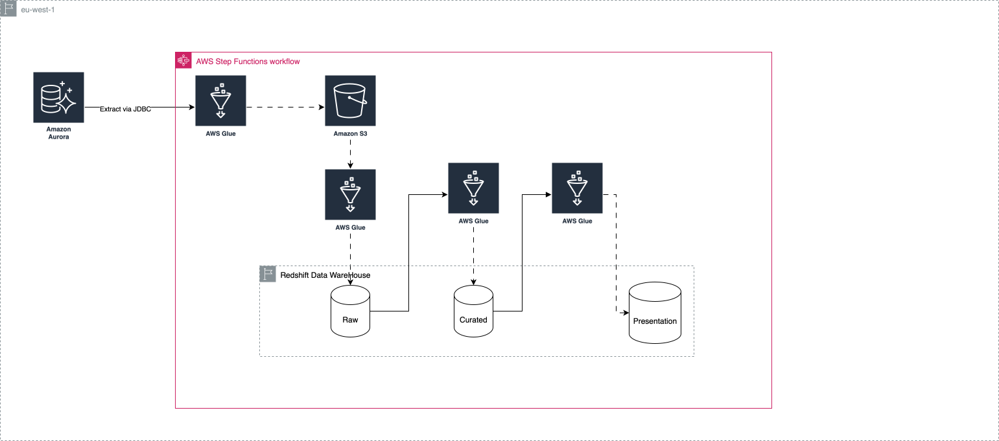

# Batch Data Processing for Rental Marketplace Analytics

## Overview

This project implements a **batch ELT pipeline** for a rental‑booking.  Raw data is extracted from an **Amazon Aurora** OLTP database, landed in **Amazon S3**, transformed with **AWS Glue**, and finally aggregated into presentation‑ready tables.  An **AWS Step Functions** state machine orchestrates the Glue jobs in sequence with retries and failure handling.

```
Aurora  ─► Glue Job (extract_aurora_to_s3) ─►  Raw S3  ─► Glue Job (lab2_s3_to_raw_complete)
                                                                  │
                                                                  ▼
                                                         Curated Redshift
                                                                  │
                                                                  ▼
                                             Glue Job (lab2_curated_to_presentation)
                                                                  │
                                                                  ▼
                                                          Presentation  
```

## Architecture Diagram 



---

## Folder / Schema Layout

```
├── scripts/
│   ├── extract_aurora_to_s3.py
│   ├── lab2_s3_to_raw_complete.py
│   ├── lab2_raw_to_curated_complete.py
│   ├── lab2_curated_to_presentation.py
|.  ├── stepfunction.json
│   └── sql_queries
└── README.md   
```

### Redshift Schemas

| Layer        | Schema         | Key Tables                                                                                                                                                                      |
| ------------ | -------------- | ------------------------------------------------------------------------------------------------------------------------------------------------------------------------------- |
| Curated      | `curated`      | `apartments`, `bookings`, `apartment_attributes`, `user_viewing`                                                                                                                |
| Presentation | `presentation` | `weekly_avg_listing_price`, `monthly_occupancy_rate`, `weekly_popular_locations`, `weekly_top_listings`, `weekly_user_bookings`, `avg_booking_duration`, `repeat_customer_rate` |

---

## Glue Jobs

| Job                                  | Purpose                                                                  | Trigger                         |
| ------------------------------------ | ------------------------------------------------------------------------ | ------------------------------- |
| **extract\_aurora\_to\_s3**          | queries the data from Aurora, pulls the data into a sark dynamic frame → writes parquet to S3 (`raw/`)    | Step Function
| **lab2\_s3\_to\_raw\_complete**      | Parses/unifies raw files, writes  parquet to **Redshift curated**  schema  | After extract job completes     |
| **lab2\_raw\_to\_curated\_complete** | Cleans, type‑casts, deduplicates, loads into **Redshift curated** schema | Step Functions                  |
| **lab2\_curated\_to\_presentation**  | Aggregates KPIs, populates **presentation** schema tables                | Step Functions                  |

---

## Step Functions State Machine

```json
{
  "StartAt": "extract_aurora_to_s3",
  "States": {
    "extract_aurora_to_s3": {
      "Type": "Task",
      "Resource": "arn:aws:states:::glue:startJobRun.sync",
      "Parameters": { "JobName": "extract_aurora_to_s3" },
      "Next": "lab2_s3_to_raw_complete",
      "Retry": [{ "ErrorEquals": ["States.ALL"], "IntervalSeconds": 10, "MaxAttempts": 3, "BackoffRate": 2.0 }],
      "Catch": [{ "ErrorEquals": ["States.ALL"], "Next": "FailState" }]
    },
    "lab2_s3_to_raw_complete": { … },
    "lab2_raw_to_curated_complete": { … },
    "lab2_curated_to_presentation": { … },
    "FailState": { "Type": "Fail", "Error": "JobFailed" }
  }
}
```

**Key points**

- Every task has identical retry (3× exponential backoff).
- Any unrecoverable failure routes to `FailState`.

---

## KPI Query Examples

```sql
-- Weekly Average Listing Price
INSERT INTO presentation.weekly_avg_listing_price
SELECT DATE_TRUNC('week', a.listing_created_on) AS week_start_date,
       COALESCE(attr.cityname, 'Unknown')       AS city,
       ROUND(AVG(a.price), 2)                   AS avg_listing_price,
       COUNT(DISTINCT a.id)                     AS active_listings_count,
       ROUND(SUM(a.price), 2)                   AS total_listings_value,
       CURRENT_TIMESTAMP                        AS created_at
FROM curated.apartments a
LEFT JOIN curated.apartment_attributes attr ON a.id = attr.id
WHERE a.is_active = TRUE
GROUP BY 1,2;
```

---

## Deployment

1. **Create Redshift schemas**.
2. **Upload Glue scripts** to an S3 code bucket.
3. **Create Glue Jobs** (use IAM role with access to S3, Redshift, KMS).
4. **Deploy Step Functions** via AWS Console.

---

## Troubleshooting

| Error                                           | Likely Cause                                | Fix                                                             |
| ----------------------------------------------- | ------------------------------------------- | --------------------------------------------------------------- |
| `EntityNotFoundException` when SFN starts a job | JobName typo in state‑machine               | Update JSON to exact Glue job name                              |
| Glue `AnalysisException DATATYPE_MISMATCH`      | Column cast mismatch (`string` ↔ `boolean`) | Trim + cast in Glue script                                      |
| Step Functions stuck in retry                   | Persistent job failure                      | Inspect Glue logs in CloudWatch → fix script or IAM permissions |

---


